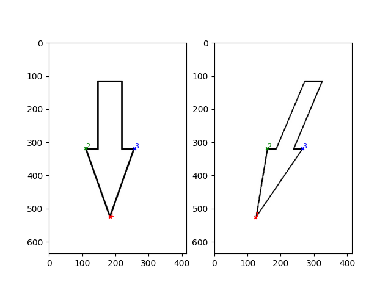

# point-match

## Usage
In `main.ipynb`:
- Change the `PATH` variable to the path of the folder containing the images.
- Change the `IMG_FORMAT` variable to the format of the images. (e.g. `jpg`, `png`, etc.)
- Change the `POINTS` variable to the number of points you want to make.

## Controls
Use **RIGHT CLICK** to make a point.

## Ouput
Creates a numpy array on shape `(POINTS x NUMBER_OF_IMAGES x 2)` in the same folder as the images.
`ARRAY[i][j]` denotes the coordiates `(x,y)` of the ith point of jth image.

## Example Output
